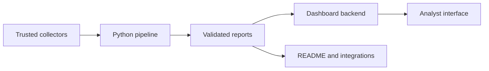

# Full-stack dashboard

CyberDailyLog has two deliberately independent surfaces:

1. the Python collection, correlation, scoring and publication pipeline;
2. a full-stack Next.js dashboard in [`dashboard/`](../dashboard/) that consumes the pipeline's public artifacts.

The production dashboard is available at:

<https://cyberdailylog-dashboard.jimblogic.chatgpt.site>

## Why this architecture

GitHub remains the transparent source of truth. The daily workflow publishes bounded, validated JSON and Markdown; the web backend reads those same artifacts and turns them into operational views. There is no second private database silently changing the result.

This gives the project three useful properties:

- **Reproducible:** the pipeline can run without the website.
- **Portable:** the dashboard can run locally or move to another compatible Node.js host.
- **Auditable:** every plotted value can be traced to a committed report.

## Data flow



The dashboard backend reads:

- `reports/latest.json` for the complete bounded evidence set and severity/priority distributions;
- `reports/portfolio-feed.json` for the compact stable contract and contextual items;
- `reports/source-health.json` for per-collector latency and acceptance;
- `reports/dashboard-feed.json` for up to 30 daily history points.

If GitHub is temporarily unavailable, the interface shows an explicitly labelled repository snapshot. It never changes snapshot data into a "live" claim.

## Run the dashboard locally

From the repository root:

```bash
cd dashboard
npm ci
npm run dev
```

Open <http://localhost:3000>.

The backend uses public raw GitHub endpoints and requires no secret. To test the optimized build:

```bash
npm run build
npm start
```

## Run only the intelligence pipeline

The original standalone workflow is unchanged:

```bash
python -m venv .venv
. .venv/bin/activate
python -m pip install .
python -m cyberdailylog run --offline-fixtures --output-dir tmp/reports
python -m cyberdailylog validate --output-dir tmp/reports
python -m cyberdailylog.portfolio_feed \
  --report tmp/reports/latest.json \
  --output tmp/reports/portfolio-feed.json
```

Generate the rolling dashboard feed from an existing archive:

```bash
python -m cyberdailylog.dashboard_feed
```

## Backend routes

| Route | Purpose |
| --- | --- |
| `GET /api/intelligence` | Fetch and normalize the current repository artifacts. |
| `GET /api/export?format=json` | Download the normalized dashboard payload. |
| `GET /api/export?format=csv` | Download the current ranked vulnerability set. |
| `GET /api/source-media?url=…` | Retrieve an Open Graph image only from an allowlisted analyst publisher. |

The media route validates the article host, image host, protocol, MIME type and maximum size before returning bytes. It is not a general-purpose URL proxy.

## Trust and privacy

- CVE, KEV, EPSS and official advisories remain evidence-bearing security data.
- Expert RSS context remains attributed and visually separated.
- Hacker News remains a community-interest signal.
- Watchlist and language preferences stay in the browser's local storage.
- No credentials, private logs, exploit code or malware samples are sent to the dashboard.

## Deployment portability

The checked-in application is standard Next.js and does not depend on a Sites project identifier. It can be moved to a compatible Node.js provider or adapted to Cloudflare/AWS without changing the public feed contract.
